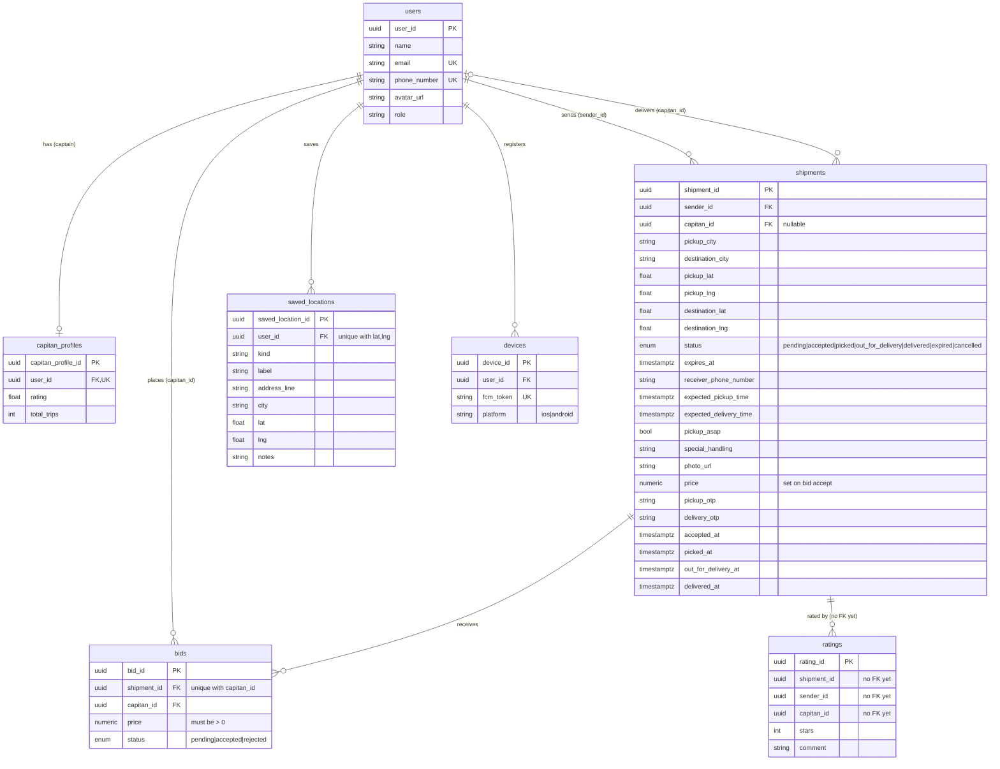

# wasel-backend

## Run with Docker

```bash
docker compose up --build
```

## DB Schema



All tables also carry `created_at` / `updated_at` (timestamptz), omitted above for brevity. The DB additionally contains [Procrastinate](https://procrastinate.readthedocs.io/) job-queue tables (installed by migration), not shown here.
